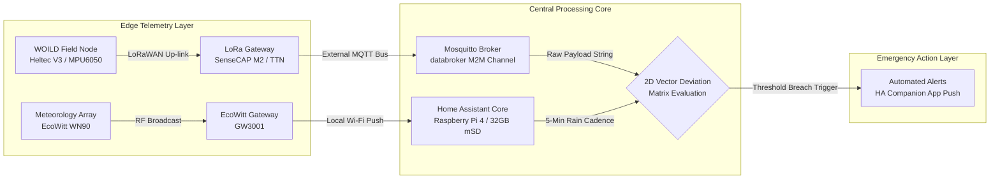

# ⚙️ Stage 3: Runtime Database Optimization & Configuration Guide

This directory houses the live production codebase running the MOSSS gateway. This includes your storage optimization matrices, mathematical template states, and active landslide threshold alert scripts.

---

## 💾 Database Optimization & MicroSD Storage Preservation

The gateway utilizes a **32GB high-endurance microSD card** to host the operating system and local database records. Because the `databroker` continuously ingests rapid telemetry updates, a default configuration will rapidly exhaust disk space or wear out the storage media through excessive write cycles.

### ⏱️ Data Ingestion Cadence & Write Mitigation

To drastically reduce write amplification on the 32GB storage media, the sensor array is tuned to discrete, physics-based reporting intervals rather than continuous streaming:

| Sensor Array | Firmware/Protocol | Normal Transmission Cadence | Engineering Justification |
| :--- | :--- | :--- | :--- |
| **EcoWitt Array** | Local Net Broadcast | **Every 5 Minutes** | Captures fast-moving meteorological fronts and acute rainfall accumulation without flooding the database. |
| **WOILD Nodes (v1.1.3)** | LoRaWAN / ESPHome | **Every 60 Minutes** | Establishes stable, ultra-low-power geological baselines. Provides early structural warning while keeping daily transaction writes minimal. |

Because transactions are structured on 5-minute and 60-minute boundaries rather than sub-second intervals, the local SQLite database engine (`home-assistant_v2.db`) easily remains compact and lightweight over your 30-day retention envelope. Ensure the `recorder:` filter block provided in `configuration.yaml` is applied to lock in this protection layer.

### 📡 End-to-End System Data Flow



---

## 🛠️ Step-by-Step Implementation

### Step 1: Access the Home Assistant Root Configuration Folder
To deploy or modify these files, access the root directory where your primary `configuration.yaml` file is hosted on your Raspberry Pi. This can be accomplished via:
* **The Studio Code Server Add-on** (Highly Recommended)
* **The File Editor Add-on** via the Home Assistant sidebar
* **Samba share Add-on** utilizing a local network folder mapping

### Step 2: Apply Configuration Files

#### [A] configuration.yaml
1. Open your active local `configuration.yaml` file.
2. Append or merge your current settings with the updated layout provided in our production file.
3. Ensure that your core directory inclusion split lines look exactly like this:
    ```yaml
    automation: !include automations.yaml
    template: !include templates.yaml
    ```

#### [B] templates.yaml
1. Open `templates.yaml` (create it in the root folder if it does not exist).
2. Overwrite the contents entirely with the sanitized `LD01` telemetry matrix code block provided.

#### [C] automations.yaml
1. Open `automations.yaml`.
2. Append or replace your active blocks with the updated `LD01` and `Heavy Rain` rules.
3. ⚠️ **CRITICAL VISUAL EDITOR WARNING:** Both automations utilize `mode: queued` and custom templates. Modifying these rules inside the Home Assistant Visual UI Editor may strip out or break the raw YAML syntax. **Always edit alerts directly in code.**

### Step 3: System Validation & Reloading
Before applying any configuration changes or restarting Home Assistant, you **MUST** validate the structural integrity of your YAML files:

1. In Home Assistant, navigate to: **Developer Tools > YAML**.
2. Click the **Check Configuration** button.
3. If any errors are flagged, double-check your spacing, indentation, and ensure no raw `<` or `>` characters are unquoted.
4. Once configuration validation passes successfully, scroll down to "YAML Configuration Reloading" on the same page and click: **"Reload All YAML Configuration"**.

---

## 🚀 Grid Expansion (Adding Hardware Nodes LD02 Through LD10)

When deployment of additional monitoring hardware is required in the field:

1. Open the target configuration file (`configuration.yaml`, `templates.yaml`, or `automations.yaml`).
2. Review the structural *Automation Scaling Note* commented at the top of the file.
3. Duplicate the relevant `LD01` code block.
4. Perform a localized **Find & Replace** inside **ONLY** your newly duplicated block:
   * Change all instances of `LD01` to your new index (e.g., `LD02`)
   * Change all instances of `ld01` to your new index (e.g., `ld02`)
   * Change all instances of `landslide_01` to your new index (e.g., `landslide_02`)
5. **Update Spatial Attributes:** Update the `baseline_x`/`baseline_y` coordinates in the Safety Matrix block and the physical `latitude`/`longitude` attributes in the Live Trackers block to match the specific, calibrated survey location of the new field hardware.
6. Re-run **Step 3 (Validation & Reloading)** to bring your new node online instantly.
